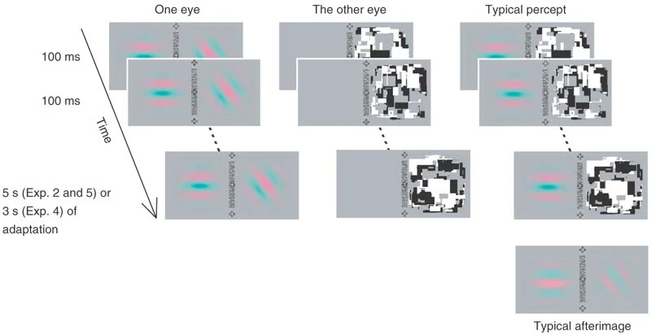
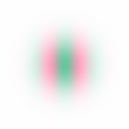
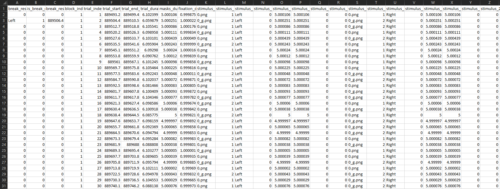

# CFS tutorial

```
Author: Gennadiy Belonosov <gennadiyb@mail.tau.ac.il>
```

💡 Here we explain how to use the CFSVM package to create a CFS experiment. As a reference, we roughly implemented Experiment 2 from the original Tsuchiya and Koch [study](https://doi.org/10.1038/nn1500).

## Start from installing the package
- [How to install](installation)

## A word of caution

- This tutorial is only intended to present the potential use and some functions of the package.
- An exact replication of the original Tsuchiya & Koch experiments is possible, but requires deeper modifications of the code, which are not discussed here.
- For simplicity, Gabor patch parameters such as spatial frequency, luminance etc. are ignored.
- The Gabor patches were generated [here](https://www.cogsci.nl/gabor-generator).

## Extracting parameters from Tsuchiya & Koch’s experiment #2

|  | 
|:--:| 
| *Methods figure from Tsuchiya & Koch, 2005* |

|  | 
|:--:| 
| *Implementation using the package: an example of the stimuli and the display. The left eye is presented with two gratings at different orientations. The right eye is presented with the CFS Mondrian display and a blank screen.* |

We extracted the following parameters from the [Methods section](https://www.nature.com/articles/nn1500#Sec9) and [Supplementary Table 1](https://www.nature.com/articles/nn1500#Sec15) of the paper:

- The contrast of two Gabor patches was set to 30%.
- The phase and orientation of the Gabors were chosen randomly.
- The flashing frequency of the Mondrians was 10 Hz.
- Adaptation continued for 5 seconds.
- After the adaptation a gray background was shown.
- In 20 experimental trials two Gabor patches were simultaneously shown on both the left and right sides of the display presented to the left eye (see figure above).
- In 10 catch trials, a Gabor patch was presented only on the non-suppressed side of the display (e.g., if the Mondrians are presented on the right side, as in the figure above, only the left side Gabor will be presented).
- The 10 catch trials were randomly interleaved with the 20 experimental trials.

## Preparing the experiment
💡 The following section explains how to use the package to program your experiment.

### Create the experiment folder
We will organize the experiment according to the [HLC lab handbook](https://osf.io/5kfrc/wiki/Chapter%203:%20Data%20Organization/).
The initial folder structure will look like this (only relevant for this tutorial folders are shown):
```
TnK_experiment_2/
├── Experiment/
│   └── RUN_ME/
|       ├── Code/
|       └── Stimuli/
└── Raw Data/
    └── Behavioral/
```

### Stimuli

Create a new folder called `Suppressed/` inside the `Stimuli/` and put in it two Gabor images with transparent backgrounds and opposite phases, like these:

 

Your `RUN_ME` folder structure should now look somewhat like this:
```
RUN_ME/
├── Code/
└── Stimuli/
    └── Suppressed/
        ├── gabor_1.png
        └── gabor_2.png
```

### Trial matrix
We will start by generating a list of trials specifying the experimental conditions. 
1. Navigate to the `Code/` folder in the MATLAB files panel (or using the `cd` command).
2. To generate trials:
    - You can either use the example script *TnK_generate_trials* (simply run it in the MATLAB command window, it will generate the trial matrix for this specific experiment) and navigate to [the last step (or two) before the run](#the-last-step-or-two-before-the-run) section in this tutorial. 
    - Or you can create your own *generate_trials.m* file based on your needs. If you follow this way, your `RUN_ME` folder structure will now look like this:
```
RUN_ME/
├── Code/
|   └── generate_trials.m
└── Stimuli/
    └── Suppressed/
        ├── gabor_1.png
        └── gabor_2.png
```
💡 The main idea of this script is to create an experiment object for each trial and save it in one `.mat` file. Let’s go over the script command by command.

#### Import the package
```matlab
import CFSVM.Experiment.* ...
    CFSVM.Element.Screen.* ...
    CFSVM.Element.Data.* ...
    CFSVM.Element.Evidence.* ...
    CFSVM.Element.Stimulus.*
```

#### Choose the experiment type
There are two types of CFS experiment in the package: BCFS (breaking CFS) and VPCFS (visual priming CFS).
The two types have many common properties, as they are both Continuous Flash Suppression, yet they are different from each other in the following ways:
- The **BCFS** code includes a breakthrough property, which records the participant’s response during the time, indicating that she detected the stimulus. The trial then stops when this response is recorded.
- The **VPCFS** code includes the mafc and pas properties which define the objective ( multiple-alternative forced choice) and subjective (perceptual awareness scale) measures of consciousness, respectively.

As in this experiment neither of mAFC or PAS is used, we will build the experiment with the **BCFS** template.


```matlab
experiment = BCFS();
```

#### Initialize the object’s properties

The **BCFS** template has multiple required properties:

| Property | Class |
| --- | --- |
| screen | CustomScreen |
| subject_info | SubjectData |
| trials  | TrialsData |
| fixation | Fixation |
| frame  | CheckFrame |
| masks  | Mondrians |
| breakthrough  | BreakResponse |

We will initialize only a few of them here: **fixation**, **frame**, **masks**, **breakthrough**. The remaining properties will be initialized at the start of the experiment. We will also add two dynamic properties for stimuli, representing two Gabor patches.

##### Checkframe

As for the CheckFrame: although the frames don’t appear in the original experiment, we will use them here as it is a common practice in the HLC lab. We will set **hex_colors** to black and white (`#000000` and `#FFFFFF`), **checker_length** to 30 pixels and **checker_width** to 15 pixels (checker is the small rectangle; the frame consists of multiple checkers).
```matlab
experiment.frame = CheckFrame( ...
    hex_colors={'#000000', '#FFFFFF'}, ...
    checker_length=30, ...
    checker_width=15);
```

##### Masks generation
Next, we move on to the Mondrians. If you have pre-generated Mondrians, put them into `RUN_ME/Stimuli/Masks/` folder and skip to the [masks initialization](#masks-initialization). Otherwise, we will use the [MondrianGenerator](./mondrian_generator.md). Note that it provides only basic functionality. If you want to create spatially, temporally or orientationally filtered or phase scrambled masks, refer to the CFS crafter: [(Wang & Han, 2022)](https://doi.org/10.3758/s13428-022-01903-7), [GitHub](https://github.com/guandongwang/cfs_crafter).

1. Import the MondrianGenerator class and construct the generator object, using the code below. The generator will randomly locate a specific numbers of figures (defined as **n_figures**, 1000 by default) that are shaped in a specific manner (defined as **type**, which can be, for example, a rectangle, a circle or a rhombus; for more shapes check the documentation) with the minimum radius equal to **x(y)_pixels**×**min_fraction** and the maximum radius equal to **x(y)_pixels**×**max_fraction** inside the `provided_path/Masks/` folder (here `Stimuli/Masks/`).
```matlab
import CFSVM.Generators.MondrianGenerator
generator = MondrianGenerator( ...
    '../Stimuli/', ... % Will generate Mondrians inside path/Masks/
    type='rectangle', ... % Available shapes are ‘rectangle’, ‘square’, ‘ellipse’, ‘circle’, ‘rhombus’ and ‘45_rotated_square’.
    x_pixels=512, ... % Width of generated images in pixels
    y_pixels=512, ... % Height of generated images in pixels
    min_fraction=1/20, ... % Minimal possible radius of a figure.
    max_fraction=1/8, ... % Maximal possible radius of a figure.
    n_figures=1000,
    cmap='grayscale' % Can be either string or MATLAB-styled RGB array.
    );
```

2. For the colormap use the **cmap** argument from the code above. It can be either a string for the supported colormaps ('grayscale', 'rgb', 'original' etc., for other options refer to the documentation) or you can provide the argument with the  [MATLAB-formatted](https://www.mathworks.com/help/matlab/ref/colormap.html) RGB array. For the grayscale with 5 tones it will look something like this:
```matlab
cmap = [0 0 0;
      0.25 0.25 0.25 ;
      0.5 0.5 0.5;
      0.75 0.75 0.75;
      1 1 1]
```
In addition, you can use the **set_shades()** method if you want to use grayscale with different numbers of tones. **set_shades()** will take the RGB array as a first argument and create a gradient from this color to white with a number of tones provided as a second argument. In the code below it creates a gradient from black to white with 8 tones, i.e., black, white and 6 tones in between.
```matlab
generator.set_shades([0,0,0], 8);
```

3. We will provide the generator object with the physical properties of the display, so it will be able to calculate the power spectral densities of the Mondrians (the output .png and .csv files will be saved inside the `provided_path/` folder). The arguments are: width in cm, width in pixels, height in cm, height in pixels, viewing distance in cm.
```matlab
generator.set_physical_properties(60, 1920, 33.5, 1080, 45)
```
Now we will run the generator using the **generate()** method, which takes **n_mondrians** as an argument. In general, **n_mondrians**=temporal_frequency×duration will generate enough masks, so that they are not repeated in a single trial. Here we will generate 10Hz*5sec=50 Mondrians.
```matlab
generator.generate(50)
```

##### Masks initialization
Now, with generated Mondrians, we will set the **masks** property.
The first parameter we will define is the relative path to the folder containing the Mondrian images. If you'd like to work with CFS-crafter generated masks, you can set a path to the `.mat` file using **crafter_masks** argument (**crafter_masks** will override the **dirpath** if both have been provided).
We will set **temporal_frequency** to 10 Hz, **duration** to 5 seconds, and **position** to "Right" (so that the masks suppress only the right Gabor patch).
To adjust the Mondrians’ position, we will set **size** to 0.45 (1 will fill the whole right eye field, 0.5 will fill half of the right eye field depending on position), **padding** to 0.3 (0 will align to the frame, 1 will align to the center of the fixation cross), and xy_ratio to 1 (square). You can also change the **contrast** and **rotation** if desired.
Finally, we will set **blank** to 5 seconds, to present a blank screen with fixation crosses and frames after the CFS stimulation has ended.


```matlab
experiment.masks = Mondrians( ...
    dirpath='../Stimuli/Masks', ...
    temporal_frequency=10, ...
    duration=5, ...
    position="Right", ...
    size=0.45, ...
    padding=0.3, ...
    xy_ratio=1, ...
    contrast=1, ...
    rotation=0,
    blank=5);
```

##### Fixation generator
Fixation target also has its own generator, you can find a tutorial on how to use it [here](./fixation_generator.md). There are multiple available shapes mainly based on [Thaler et al., 2013](https://doi.org/10.1016/j.visres.2012.10.012). Here we will generate the simplest cross:

```matlab
import CFSVM.Generators.FixationGenerator

generator = FixationGenerator( ...
    '../Stimuli/', ...
    radius=256, ...
    hex_color='#000000', ...
    is_smooth_edges=true, ...
    smoothing_cycles=5);

generator.C(cross_width=64)
```

##### Fixation
To initialize the fixation property we will first provide a directory which contains our generated fixation target, second, we will set **duration** to 1 second and **size** to 0.05 (5%) of the frame. It also has additional parameters, like **rotation**, **contrast** etc. (for more, please, check the documentation), which we won't set here.
```matlab
experiment.fixation = Fixation( ...
    '../Stimuli/Fixation', ...
    duration=1, ...
    size=0.05);
```


##### Stimuli
Now we will add two stimuli properties for the Gabor patches.

Create the properties first:
```matlab
experiment.addprop('stimulus_1');
experiment.addprop('stimulus_2');
```

Then we will initialize them. As a first parameter we will provide a path to the folder with two Gabors that we presented here earlier.

We will set **show_duration** for both of the parameters to 5 seconds. We will set a different **position** for them: "Left" for the first and "Right" for the second.
We will set **contrast** to 0.3 (30%), **size** to 0.5, **padding** to 0.5 and **xy_ratio** to 1.
```matlab
experiment.stimulus_1 = SuppressedStimulus( ...
    '../Stimuli/Suppressed/', ...
    show_duration=5, ...
    position="Left", ...
    contrast=0.3, ...
    size=0.5, ...
    padding=0.5, ...
    xy_ratio=1);
experiment.stimulus_2 = SuppressedStimulus( ...
    '../Stimuli/Suppressed/', ...
    show_duration=5, ...
    position="Right", ...
    contrast=0.3, ...
    size=0.5, ...
    padding=0.5, ...
    xy_ratio=1);
```
##### Breakthrough
Here you can set the parameters for the **breakthrough** property, which basically records the time and the key pressed by the participant. This is not very relevant for our needs here, so we will just initialize it and move on.

```matlab
experiment.breakthrough = BreakResponse();
```

Our **experiment** object is ready now. Let’s set the number of blocks and trials. The number of blocks should be a natural number and the number of trials is defined by a list of `length=n_blocks` containing the number of trials in every block. For example, if we want to have one block with 20 trials and another block with 30 trials we will set `n_blocks = 2`, `n_trials = [20, 30]`. But in the current experiment, there is only one block with 30 trials.
The last line will initialize a cell array for the trial matrix.

```matlab
n_blocks = 1;
n_trials = [30];
trial_matrix = cell(1, n_blocks);
```

Now, for all 30 trials we will create a copy of our experiment object, randomize the Gabor images and their orientations for both stimuli properties in this copied object and then add the object to the trial matrix for every trial (as the code that runs the experiment will expect trial matrix to be an array of arrays of objects).

For 10 of these 30 trials we will set the **contrast** for the second stimulus to 0, so that the right Gabor doesn’t appear.

After every block (here we have only one), we will shuffle the trials.


```matlab
orientations = [0, 45, 90, 135];
n_images = 2;
for block = 1:n_blocks
    for trial = 1:n_trials(block)
        exp_copy = copy(experiment);
        exp_copy.stimulus_1.index = randi(n_images);
        exp_copy.stimulus_1.rotation = orientations(randi(length(orientations), 1));
        exp_copy.stimulus_2.index = randi(n_images);
        exp_copy.stimulus_2.rotation = orientations(randi(length(orientations), 1));
        if trial >= 20
            exp_copy.stimulus_2.contrast = 0;
        end
        trial_matrix{block}{trial} = exp_copy;
    end
    trial_matrix{1} = trial_matrix{1}(randperm(numel(trial_matrix{1})));
end
```

Save the trial matrix to the file:
```matlab
if ~exist('../TrialMatrix', 'dir')
    mkdir('../TrialMatrix')
end
save('../TrialMatrix/experiment.mat', 'trial_matrix')
```

Don’t forget to execute the code before running the experiment! After executing it you will find the file with the trial matrix in the `RUN_ME/TrialMatrix/` directory and generated Mondrians in the `RUN_ME/Stimuli/Masks/`.
Your `RUN_ME` folder structure now should look like this:
```
RUN_ME/
├── Code/
|   ├── generate_trials.m
|   └── main.m
├── Stimuli/
|   ├── Suppressed/
|   |   ├── gabor_1.png
|   |   └── gabor_2.png
|   └── Masks/
|       ├── mondrian_1.png
|       |   ⋮    ⋮    ⋮    ⋮
|       └── mondrian_<n>.png
└── TrialMatrix/
    └──experiment.mat
```

Congrats! We are almost there!

## The last step (or two) before the run

### Customizing the instructions
There are multiple types of instructions:
- Introduction - a general description of the experiment.
- Block introduction - a description of the forthcoming block (different for every block).
- Rest - an instruction appearing after each trial (same for every trial).
- Farewell

We will create an `Instructions` folder in the `RUN_ME` directory. Next, each type of the instruction will have its own subfolder; the introduction for each block will have its own folder. In each subfolder we will put corresponding images. When the experiment is running the code will show the images by their [natural order](https://en.wikipedia.org/wiki/Natural_sort_order). You can set the background of the images as transparent in an image editor and save them as .png files if you want the background color the same as in the experiment.
The **exact** names of the subfolders should be: introduction, introduction, block_introduction_1, …, block_introduction_n (where n is the number of blocks), rest, farewell. For the experiment we are building here the folder structure will look like this:
```
RUN_ME/
└── Instructions/
    ├── introduction/
    |   ├── 1.png
    |   └── 2.png
    ├── block_introduction_1/
    |   ├── 1.png
    |   ├── 2.png
    |   └── 3.png
    ├── rest/
    |   └── 1.png
    └── farewell/
        └── 1.png
```

### Writing main.m
So far we’ve generated the trials. Now we want to run the experiment.
Let’s start building our `main.m` script, which we will put inside the `Code/` folder near the `generate_trials.m` script. 
We will now go over a few parameters that can be adjusted to create specific settings you want.
First, we will make sure that the workspace and the screen are cleared:
```matlab
Screen('CloseAll');
close all;
clear;
```

Import parts of the package we will use here:
```matlab
import CFSVM.Experiment.* ...
    CFSVM.Element.Screen.* ...
    CFSVM.Element.Data.*
```

Initialize the BCFS object and provide it with the **save_to_dir** - path to the folder you want the results to be saved. According to the lab handbook this will be `Raw Data/Behavioral/`. If you created your own instruction functions you can pass the folder containing these functions to the **path_to_functions** argument .
```matlab
experiment = BCFS(save_to_dir='../../../Raw Data/Behavioral');
```

Initialize the **subject_info** property by providing a directory to save the info in.
We will put it in `Tnk_experiment_2/Raw Data/Demographics/`.
```matlab
experiment.subject_info = SubjectData( ...
    dirpath='../../../Raw Data/Demographics');
```

Initialize **trials** property by providing a path to the already generated file with the trial matrix.

```matlab
experiment.trials = TrialsData( ...
    filepath='../TrialMatrix/experiment.mat');
```

Initialize the **instructions** property by providing a path to the folder containing instructions subfolders which were created in the [previous step](#customizing-the-instructions). **backward_key**, **forward_key** are the key names for moving between screens and **proceed_key** for proceeding to the experiment. If `proceed_key=''` (empty char), it will be the same as the **forward_key**. You can also provide multiple keys for every argument, e.g., `backward_key={'LeftArrow', 'a'}`. The key names should correspond to the unified PTB style. To find the correct spelling of keys, run in the matlab console two commands: `KbName('UnifyKeyNames')` and `KbName('KeyNames')`.

```matlab
experiment.instructions = Instructions( ...
    "../Instructions/", ...
    backward_key='LeftArrow', ...
    forward_key='RightArrow',
    proceed_key='Return');
```


Initialize the **screen** property by setting **is_stereo** to true and defining the size and location of the left rectangle by providing **initial_rect** with pixel coordinates of its upper left and lower right vertices, like this: [x0, y0, x1, y1]. The first two numbers in this array are x and y pixels of the upper left vertex, the last two numbers are x and y pixels of the lower right vertex. The right rectangle will be set symmetrically to the left one.

We will also provide hex code for the **background color** - `#AEAEAE` gray here.

```matlab
experiment.screen = CustomScreen( ...
    is_stereo=true, ...
    initial_rect=[30, 90, 930, 990], ...
    background_color='#AEAEAE');
```

The last two lines of code are quite self explanatory:

```matlab
experiment.run()

Screen('CloseAll')
```

That’s it! You can run the `main.m` script now!

## Running the experiment

Right after executing the script you’ll see the dialogue for collecting the subject data:

```
>> main
Subject code
> HZ4
Date of birth
> 01011900
Dominant eye
> Right
Dominant hand
> Both
```

Now you will proceed to the experiment itself.

And that's it! Once you’ve adjusted the screens, you'll see the introduction screen. After that, the CFS will begin.


## The data

The raw trial data will appear in the `Tnk_experiment_2/Raw Data/Behavioral/RawTrials/`. Every `.mat` file will contain an experiment object similar to the ones we have generated while creating the trial matrix, but containing timings and subject responses.
You can run `CFSVM.Utils.extract_from_raw_cfs(path_to_raw_trials, subject_code)`
(*'../../../Raw Data/Behavioral/RawTrials'* and *'HZ4'* in this example) script to extract the data from the raw files. It will create two csv tables in `Behavioral/Extracted/<subject code>/` and `Behavioral/Processed/` folders, the first one containing raw timings and the second one processed ones (e.g., durations instead of onsets and offsets).
The final folder structure will look like this:
```
TnK_experiment_2/
├── Experiment/
│   └── RUN_ME/
|       ├── Code/
|       |   ├── generate_trials.m
|       |   └── main.m
|       ├── Stimuli/
|       |   ├── Suppressed/
|       |   |   ├── gabor_1.png
|       |   |   └── gabor_2.png
|       |   └── Masks/
|       |       ├── mondrian_1.png
|       |       |   ⋮    ⋮    ⋮    ⋮
|       |       └── mondrian_<n>.png
|       ├── TrialMatrix/
|       |   └──experiment.mat
|       └── Instructions/
|           ├── introduction/
|           |   ├── 1.png
|           |   └── 2.png
|           ├── block_introduction_1/
|           |   ├── 1.png
|           |   ├── 2.png
|           |   └── 3.png
|           ├── rest/
|           |   └── 1.png
|           └── farewell/
|               └── 1.png
└── Raw Data/
    ├── Demographics/
    |	└── HZ4.csv
    └── Behavioral/
        ├── Raw Trials/
        |   └── HZ4/
        |       ├── block1_trial1.mat
        |       |   ⋮    ⋮    ⋮    ⋮
        |       └── block<n>_trial<m>.mat
        ├── Extracted/
        |   └── HZ4/
        |       ├── HZ4_extracted.csv
        |       └── HZ4_ifis_histogram.png
        └── Processed/
            └── HZ4_processed.csv
```

|  | 
|:--:| 
| *Raw trials* |

|  | 
|:--:| 
| *Extracted, not processed csv* |

|  | 
|:--:| 
| *Processed csv* |


## Thanks!