# Mondrian generator

The capabilities of the generator are presented below. In general, given Mondrian mask parameters the generator will create and save Mondrian images.

## How to use
### Import the generator class
```matlab
import CFSVM.Generators.MondrianGenerator
```

### Initialize the generator object
```matlab
gen = MondrianGenerator( ...
    '../Stimuli/', ...
    type='rectangle', ...
    x_pixels=512, ...
    y_pixels=512, ...
    min_fraction=1/20, ...
    max_fraction=1/8, ...
    n_figures=1000,
    cmap='original');
```

The arguments of the object constructor are as follows: 
#### dirpath
First, the path to the parent directory in which the `Masks/` folder will be created. The generated Mondrians will be saved inside this folder. 

#### type
Next, the **type** argument describes the shape of the figures, which are overlaid in the Mondrian. Currently available shapes are rectangle, square, ellipse, circle, rhombus, 45 degrees rotated square.

rectangle|ellipse|rhombus
:-------------------------:|:-------------------------:|:-------------------------:
 |  | 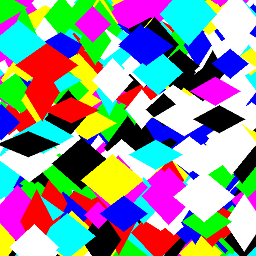
&emsp;&emsp;&emsp;&emsp;&emsp;**square**&emsp;&emsp;&emsp;&emsp;&emsp; | &emsp;&emsp;&emsp;&emsp;&emsp;&nbsp;&nbsp;**circle**&emsp;&emsp;&emsp;&emsp;&emsp;&nbsp;&nbsp; | **45_rotated_square**
 |  | 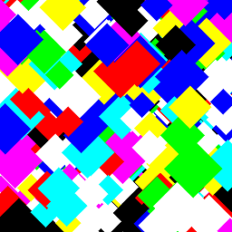

#### x_pixels & y_pixels
These two arguments will define image resolution.

#### min_fraction & max_fraction
Define the range of pixels a single figure can occupy. For example, if x_pixels and y_pixels are 512, **min_fraction**  is 1/32 and **max_fraction** is 1/8, then the minimal and the maximal height and width of figures in the Mondrian will be 512/32=16 pixels and 512/8=64 pixels, respectively.

min_frac=$\frac{1}{10}$,<br/>max_frac=$\frac{1}{8}$|min_frac=$\frac{1}{20}$,<br/>max_frac=$\frac{1}{8}$|min_frac=$\frac{1}{100}$,<br/>max_frac=$\frac{1}{8}$
:-------------------------:|:-------------------------:|:-------------------------:
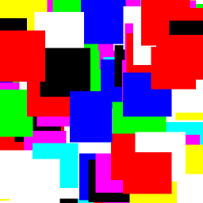 | 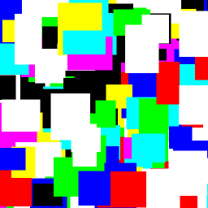 | 

min_frac=$\frac{1}{20}$,<br/>max_frac=$\frac{1}{2}$|min_frac=$\frac{1}{20}$,<br/>max_frac=$\frac{1}{4}$|min_frac=$\frac{1}{20}$,<br/>max_frac=$\frac{1}{8}$
:-------------------------:|:-------------------------:|:-------------------------:
 |  | 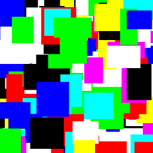

#### n_figures
Number of figures overlayed in the Mondrian.

n_figures=10|n_figures=50|n_figures=100
:-------------------------:|:-------------------------:|:-------------------------:
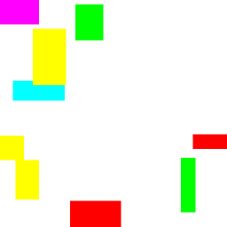 | 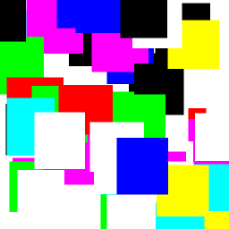 | 

#### cmap
Mondrian colormap, can be either [MATLAB-styled colormap](https://uk.mathworks.com/help/matlab/ref/colormap.html) (three-column matrix with values from 0 to 1) or one of the following strings: 'grayscale', 'rgb', 'original', 'reds', 'blues', 'greens'.

grayscale | &emsp;&emsp;&nbsp;&nbsp;rgb&emsp;&emsp;&nbsp;&nbsp;| &nbsp;original&nbsp;
:-------------------------:|:-------------------------:|:-------------------------:
 |  | 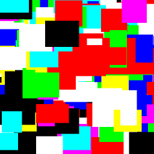
**reds** | **blues** | **greens**
 |  | 

### Modify cmap
#### set_shades()
You can use the `set_shades()` method to set a custom gradient for your Mondrians.
E.g., using RGB triplet for dark magenta [0.545, 0, 0.545] and 20 tones from the provided RGB to the white color
```
gen.set_shades([0.545, 0, 0.545], 20)
```
we can generate the following Mondrian:

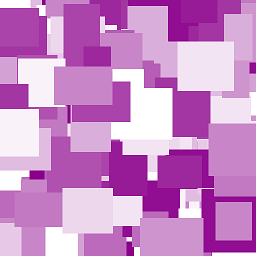

#### Custom cmap
You can always use a custom colormap by modifying the **cmap** property `gen.cmap=[RGB triplet; RGB triplet; ...; RGB triplet]` for your Mondrian. For example, 
```
gen.cmap=[0.8 0.6 0.2;
    0.4 0 0.6;
    0.8 0 0.6;
    0 0.8 0.8;
    0.6 0 0.4;
    1.0 1.0 1.0;
    0 0 0];
```
will produce the following Mondrian:


### Physical properties and power spectral density (PSD) of Mondrians
If you provide the generator object with physical properties of the screen, it will calculate PSD for every generated Mondrian and save it as a CSV file. It will also plot the average PSD for the generated Mondrians.
The arguments of the `set_physical_properties()` are screen width in cm, screen width in pixels, screen height in cm, screen height in pixels, viewing distance in cm.
```
gen.set_physical_properties(59, 1920, 33, 1080, 45)
```

Rectangle|&emsp;&emsp;Ellipse&nbsp;&emsp;|Rhombus
:-------------------------:|:-------------------------:|:-------------------------:
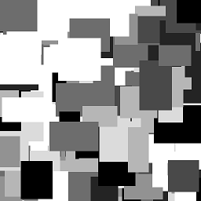 |  | 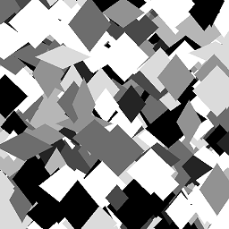
 |  | 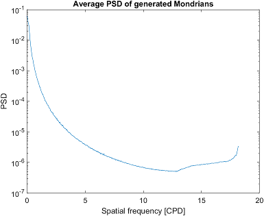

### Generate
```
gen.generate(50, fname='mond.png')
```
will finally generate 50 Mondrians named *mond_1.png* to *mond_50.png* inside `dirpath/Masks/` folder.